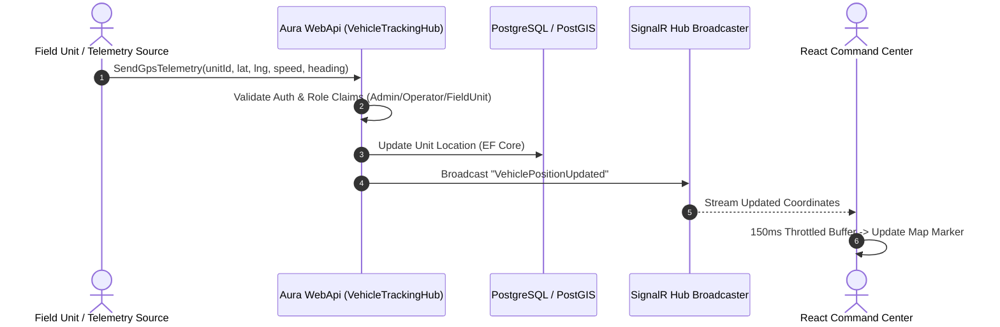

# Aura Crisis Network

<p align="center">
  
  
  
  
  
  
  
</p>

A full-stack, real-time crisis management and emergency response platform designed to unify live seismic data ingestion, citizen incident reports, emergency vehicle telemetry, PostGIS geospatial analysis, and operational unit dispatch into a single command interface.

[🚀 Live Demo App](https://aura-crisis-network.vercel.app) • [⚙️ Backend API Server](https://aura-crisis-network-1.onrender.com) • [🏥 Health Check Endpoint](https://aura-crisis-network-1.onrender.com/api/v1/health)

---

## 🖼️ Command Center Overview

<p align="center">
  
</p>

---

## 📌 Problem & Solution

### The Problem
During natural disasters and emergency situations, crisis management teams face significant operational friction:
* **Fragmented Information:** Live earthquake feeds, citizen distress calls, and field asset locations reside in isolated systems.
* **Delayed Decision-Making:** Calculating which emergency unit is closest to a crisis point relies on manual estimation or static region lookup.
* **Uncoordinated Telemetry:** Command operators lack real-time visibility into the movement, speed, and status of dispatched units.
* **Timezone Inconsistencies:** Seismic data feeds published in local time zones often get misparsed during cross-system transmission, confusing operational timestamps.

### The Solution
**Aura Crisis Network** acts as a centralized command plane:
1. **Live Data Ingestion:** Ingests live seismic data from Kandilli Observatory, converting local Turkish timestamps (`Europe/Istanbul` / UTC+3) into normalized UTC timestamps while preserving accurate local displays.
2. **PostGIS Geospatial Engine:** Uses PostgreSQL/PostGIS spatial indexes and K-Nearest Neighbors (KNN) algorithms to calculate distance-optimized emergency unit dispatching.
3. **Real-time SignalR Telemetry:** Streams vehicle GPS coordinates, speed, and heading over WebSockets directly to an interactive SVG map canvas with throttled render buffers to prevent UI thread lock.
4. **Role-Gated Operational Workflows:** Provides distinct workspaces for Citizens, Command Operators, Field Units, and System Administrators under a secure Role-Based Access Control (RBAC) architecture.

---

## 👥 Target Users & System Roles

| Role | Access Scope & Key Responsibilities |
| :--- | :--- |
| **Operator** | Monitored live maps, verifies citizen reports, escalates events, and dispatches nearest emergency units. |
| **Admin** | Manages risk zones, inspects system audit logs, monitors OpenTelemetry health metrics, and oversees role assignments. |
| **Citizen** | Submits geo-tagged crisis reports with description details and photo attachments. |
| **FieldUnit** | Emergency response vehicles (Ambulance, Fire Engine, Police Patrol, Search & Rescue) transmitting live telemetry. |

---

## 🌟 Key Features

* **Real-time Crisis Command Center:** Interactive vector map displaying active disasters, hazard severity indicators, and live event streams.
* **Kandilli Earthquake Ingestion:** Automated background service ingesting live seismic data with timezone normalization.
* **PostGIS Nearest-Unit Detection (KNN):** Calculates nearest emergency assets relative to an event location using spatial distance functions (`ST_Distance` / `ST_DWithin`).
* **Spatial Risk & Buffer Analysis:** Generates circular spatial buffer zones (`ST_Buffer`) and checks polygon intersections (`ST_Intersects`) for hazard impact assessment.
* **SignalR Vehicle Telemetry:** WebSocket channels (`/hubs/vehicles`) streaming high-frequency GPS position updates with 150ms throttled UI batching.
* **Citizen Reporting with Attachments:** Multipart file upload pipeline with ownership checks and status tracking.
* **Security & Privilege Hardening:** ASP.NET Core Identity + JWT Bearer Tokens, Refresh Tokens, IP-partitioned Rate Limiting, and strict role enforcement (public registration forced to `Citizen`).
* **Observability & Diagnostics:** Structured Serilog logging with `X-Correlation-ID` propagation, OpenTelemetry Prometheus metric scraping (`/metrics`), and multi-tier health endpoints (`/health`, `/health/live`, `/health/ready`).

---

## 📸 UI Showcase

<table width="100%">
  <tr>
    <td width="50%" align="center">
      <b>Geospatial Risk & Buffer Analysis</b><br/><br/>
      
    </td>
    <td width="50%" align="center">
      <b>System Health & Telemetry Dashboard</b><br/><br/>
      
    </td>
  </tr>
</table>

---

## 🎨 UI/UX Design System

The application interface is engineered specifically for high-stress operational environments where visual hierarchy and fast scannability are critical:

* **Dark Operational Aesthetic:** Built with a custom OKLCH dark color palette to reduce eye fatigue during long command shifts.
* **Glassmorphism Overlay Panels:** Floating control panels using CSS backdrop blurs (`backdrop-blur-md`) keep background map layers contextually visible.
* **Severity-Based Color System:**
  * 🔴 **Critical Severity (80-100):** Red (`#ef4444`) with animated pulse indicators (`animate-pulse`).
  * 🟠 **Warning Severity (50-79):** Amber (`#f59e0b`).
  * 🟢 **Active / Online Status:** Emerald (`#10b981`).
* **Animated Seismic Visualization:** Custom SVG keyframe stroke-dasharray animations for wave progression.
* **Inter Typography:** Configured with tabular numeric figures (`num`) to prevent layout shifts during numerical telemetry updates.

---

## 🛠️ Technology Stack

### Frontend
* **Core:** React 19 (`react` 19.2.0), TypeScript 5.8
* **Meta-Framework & Engine:** TanStack Start 1.168, Nitro Engine (3.0 Beta)
* **Routing & State:** TanStack Router 1.170, TanStack Query 5.101, React Context API (`AuthProvider`)
* **Styling:** Tailwind CSS v4, Radix UI Primitives, Lucide Icons, Sonner Toasts
* **Real-time & Charts:** `@microsoft/signalr` 10.0, Recharts 2.15
* **Forms & Validation:** React Hook Form 7.71, Zod 3.24

### Backend
* **Core:** ASP.NET Core Web API 10.0 (`net10.0`), C# 13
* **Architecture:** Clean Architecture, CQRS with MediatR 14.2
* **Persistence & GIS:** Entity Framework Core 10.0, PostgreSQL 16, PostGIS 3.4, NetTopologySuite 2.6
* **Security & Auth:** ASP.NET Core Identity 10.0, JWT Bearer 10.0, IP-Partitioned Rate Limiter
* **Real-time:** ASP.NET Core SignalR (`CrisisHub`, `VehicleTrackingHub`)
* **Observability:** Serilog 10.0, OpenTelemetry 1.11, ASP.NET Core Health Checks

### DevOps & Infrastructure
* **Containerization:** Docker (Multi-stage build), Docker Compose (PostGIS 16-3.4)
* **CI/CD:** GitHub Actions (`ci.yml`, `cd.yml`)
* **Registry & Hosting:** GitHub Container Registry (`ghcr.io`), Render (Backend), Vercel (Frontend)

---

## 🏗️ Architecture & Component Design

The backend is structured according to **Clean Architecture** principles, enforcing strict separation of concerns and unidirectional dependency flow:

```
                  ┌─────────────────────────────────────────┐
                  │          React Command Center           │
                  └────────────────────┬────────────────────┘
                                       │ HTTP / WebSockets
                                       v
                  ┌─────────────────────────────────────────┐
                  │               Aura.WebApi               │
                  │   (Controllers, SignalR Hubs, Filters)  │
                  └────────────────────┬────────────────────┘
                                       │
                                       v
                  ┌─────────────────────────────────────────┐
                  │            Aura.Application             │
                  │   (CQRS Commands, Queries, Behaviors)   │
                  └──────────┬───────────────────┬──────────┘
                             │                   │
                             v                   v
┌──────────────────────────────────────┐  ┌──────────────────────────────────┐
│             Aura.Domain              │  │       Aura.Infrastructure        │
│ (Entities, Value Objects, Interfaces)│  │ (EF Core, PostGIS, Identity, JWT)│
└──────────────────────────────────────┘  └──────────────────┬───────────────┘
                                                             │
                                                             v
                                                  ┌─────────────────────┐
                                                  │ PostgreSQL / PostGIS│
                                                  └─────────────────────┘
```

### Layer Responsibilities
* **`Aura.Domain`:** Encapsulates core business models (`Event`, `EmergencyUnit`, `CitizenReport`, `RiskZone`, `AuditLog`), Domain Value Objects (`GeoPoint`), and Domain Enums. Zero external package dependencies.
* **`Aura.Application`:** Contains business use-cases using CQRS pattern (MediatR). Implements pipeline behaviors for query caching (`CachingBehavior`) and cache invalidation (`CacheInvalidationBehavior`).
* **`Aura.Infrastructure`:** Implements data access using EF Core and PostGIS, Identity management (`IdentityService`), JWT token generation (`JwtTokenProvider`), external data ingestion (`KandilliIngestionService`), and structured Serilog logging.
* **`Aura.WebApi`:** Entry point exposing REST APIs, SignalR hubs, rate limiting middleware, CORS handling, and OpenTelemetry instrumentation.

---

## 🗺️ Geospatial & PostGIS Integration

Coordinating disaster response requires spatial logic directly embedded into the database domain:

```csharp
// Example: Finding nearest emergency units using PostGIS KNN spatial distance
public async Task<IReadOnlyList<EmergencyUnitDto>> Handle(
    GetNearestEmergencyUnitsQuery request, 
    CancellationToken cancellationToken)
{
    var origin = _geometryFactory.CreatePoint(new Coordinate(request.Longitude, request.Latitude));

    var units = await _dbContext.EmergencyUnits
        .Where(u => u.Status == UnitStatus.Available)
        .OrderBy(u => u.Location.Distance(origin))
        .Take(request.Count)
        .ToListAsync(cancellationToken);

    return _mapper.Map<IReadOnlyList<EmergencyUnitDto>>(units);
}
```

* **SRID 4326 (WGS84):** Standard spatial reference system used for storing latitude/longitude coordinates.
* **`ST_Distance` / `ST_DWithin`:** Used for spatial KNN queries to find available response vehicles near an active crisis.
* **`ST_Intersects`:** Evaluates whether a given latitude/longitude intersects registered seismic fault or flood hazard polygons (`RiskZone`).
* **`ST_Buffer`:** Generates circular spatial impact buffer geometries around high-severity event centers.

---

## 📡 Real-time SignalR Telemetry Flow

The platform maintains two specialized SignalR hubs:
1. **`CrisisHub` (`/hubs/crisis`):** Broadcasts new events (`EventCreated`) and status changes (`ReportStatusChanged`). Supports district-based group subscriptions (`JoinDistrictGroup`).
2. **`VehicleTrackingHub` (`/hubs/vehicles`):** Broadcasts real-time vehicle GPS positions (`VehiclePositionUpdated`). Restricted to `Admin`, `Operator`, and `FieldUnit` roles.



---

## 🔐 Authentication & Security Hardening

* **Identity & JWT:** ASP.NET Core Identity managing user accounts with 15-minute HMAC-SHA256 access tokens and 7-day database-backed refresh tokens.
* **Privilege Escalation Protection:** Public registration (`POST /api/v1/auth/register`) strictly forces the `Citizen` role regardless of caller input payload.
* **IDOR Prevention:** Handlers for notification updates and attachment uploads verify resource ownership against `ICurrentUserService.UserId`.
* **CORS Policy:** Restricts origins to configured Vercel production/preview domains and localhost with credentials support.
* **IP-Partitioned Rate Limiting:** Applied to authentication and general endpoints to prevent brute-force attacks without locking out valid users sharing proxy IPs.

---

## 🔄 Data Ingestion & Timezone Pipeline

Seismic data from Kandilli Observatory is ingested automatically via background workers:

```
Kandilli Live API / Scraping
            │
            ▼ (Raw Local Time: "2026.08.11 17:42:15")
KandilliIngestionService
            │
            ▼ (Parse +03:00 Offset -> Convert to Universal Time)
UTC DateTimeOffset (2026-08-11T14:42:15Z)
            │
            ▼ (Persisted in PostgreSQL)
Web API JSON Response ("2026-08-11T14:42:15Z")
            │
            ▼ (Frontend Format: Intl.DateTimeFormat 'Europe/Istanbul')
Rendered UI Timestamp ("17:42")
```

---

## 🧪 Testing Suite

The solution includes an automated test suite with **83 passing tests** across unit and integration projects:

* **`Aura.UnitTests` (61 tests):** Verifies Domain Entities, Command/Query Handlers, Secret Validation Rules, and Pipeline Behaviors using `xUnit`, `Moq`, and `FluentAssertions`.
* **`Aura.IntegrationTests` (22 tests):** Tests end-to-end HTTP endpoints, RBAC authorization, CORS headers, IDOR security boundaries, Citizen Reports, and PostGIS spatial distance calculations using `Testcontainers.PostgreSql`.

```bash
# Run unit and integration tests
dotnet test backend/AuraCrisisNetwork.slnx --logger "console;verbosity=normal"
```

---

## 📊 Observability & Health Infrastructure

### Logging & Correlation IDs
* Structured JSON logging via **Serilog** outputting to console and rolling files.
* `CorrelationIdMiddleware` injects an `X-Correlation-ID` into every HTTP request header and log context.

### Prometheus Metrics
* OpenTelemetry instrumentation exposes standard Prometheus scraping metrics at `/metrics`.

### Health Endpoints
| Endpoint | Purpose | Health Check Scope |
| :--- | :--- | :--- |
| `GET /health` | Detailed JSON Status | Database connectivity, Redis availability, memory usage, total duration |
| `GET /health/live` | Liveness Probe | Light check confirming application process is running |
| `GET /health/ready` | Readiness Probe | Confirms application is ready to serve traffic (`ready` tag checks) |
| `GET /api/v1/health` | Application Health API | Detailed component status, latency timings, memory metrics for UI consumption |

---

## 🔌 API Reference Overview

Key REST endpoints exposed by the API (full schema available via `/openapi/v1.json`):

| HTTP Method | Route | Description | Auth Required | Required Role |
| :--- | :--- | :--- | :--- | :--- |
| `POST` | `/api/v1/auth/login` | Authenticate user and issue JWT tokens | No | None |
| `POST` | `/api/v1/auth/register` | Register new citizen account | No | Public (Forces `Citizen`) |
| `GET` | `/api/v1/events` | List active crisis and earthquake events | No | None |
| `POST` | `/api/v1/events/{id}/escalate` | Escalate event severity level | Yes | `Operator, Admin` |
| `POST` | `/api/v1/reports` | Submit geo-tagged citizen crisis report | Yes | Authenticated User |
| `POST` | `/api/v1/reports/{id}/attachments` | Upload photo attachment for a report | Yes | Report Owner |
| `GET` | `/api/v1/emergency-units/nearest` | Find nearest response units (PostGIS KNN) | No | None |
| `POST` | `/api/v1/emergency-units/{id}/dispatch` | Dispatch emergency unit to an event | Yes | `Operator, Admin` |
| `GET` | `/api/v1/risk-zones/buffer` | Calculate spatial buffer analysis | No | None |
| `GET` | `/api/v1/audit-logs` | Retrieve system audit log history (Paged) | Yes | `Admin` |

---

## 💻 Local Development Setup

### Prerequisites
* [.NET 10.0 SDK Preview](https://dotnet.microsoft.com/)
* [Node.js 22+](https://nodejs.org/)
* [Docker Desktop](https://www.docker.com/)

### 1. Clone Repository
```bash
git clone https://github.com/Aygen5/Aura-Crisis-Network.git
cd Aura-Crisis-Network
```

### 2. Start PostgreSQL & PostGIS Container
```bash
cd backend
docker-compose up -d
```

### 3. Run Backend API
```bash
dotnet restore AuraCrisisNetwork.slnx
dotnet run --project src/Aura.WebApi/Aura.WebApi.csproj
```
The API server will start at `http://localhost:5232`.

### 4. Run Frontend Application
```bash
cd ../frontend
npm install
npm run dev
```
The frontend dev server will start at `http://localhost:5173`.

---

## 🔑 Pre-Seeded Demo Accounts

For evaluation and testing purposes, the application automatically seeds demo credentials on initial startup:

| Account Type | Email | Password | Assigned Role |
| :--- | :--- | :--- | :--- |
| **Command Operator** | `operator@aura.com` | `Aura2026!` | `Operator` |
| **Citizen User** | `citizen@aura.com` | `Aura2026!` | `Citizen` |

> ⚠️ *Note: Demo accounts are scoped to evaluation environments and utilize standard test credentials.*

---

## 📁 Repository Structure

```
Aura-Crisis-Network/
├── .github/
│   └── workflows/
│       ├── ci.yml                 # Build, test, and lint workflow
│       └── cd.yml                 # Docker image build and GHCR push workflow
├── backend/
│   ├── Dockerfile                 # Multi-stage .NET 10 Dockerfile
│   ├── docker-compose.yml         # PostGIS 16 container setup
│   └── src/
│       ├── Aura.Domain/           # Entities, Value Objects, Domain Interfaces
│       ├── Aura.Application/      # CQRS Commands, Queries, Handlers, Behaviors
│       ├── Aura.Infrastructure/   # EF Core, PostGIS, Identity, Ingestion, Serilog
│       └── Aura.WebApi/           # REST Controllers, SignalR Hubs, Middleware
├── frontend/
│   ├── Dockerfile                 # Frontend Docker container definition
│   ├── src/
│   │   ├── components/aura/       # UI Components (MapCanvas, TopNav, AppShell)
│   │   ├── lib/                   # API, HTTP, and SignalR clients
│   │   ├── providers/             # Auth & SignalR React Context Providers
│   │   ├── routes/                # TanStack Router page views
│   │   └── utils/                 # Timezone and formatting utilities
│   └── package.json
├── docs/
│   └── screenshots/               # Application UI screenshots
└── LICENSE                        # MIT License
```

---

## 🚀 CI/CD & Deployment Architecture

* **CI Pipeline (`.github/workflows/ci.yml`):** Runs on pull requests and pushes to `main`. Spins up a `postgis/postgis:16-3.4` service container, executes `dotnet build`, runs all 83 unit/integration tests, and verifies frontend production compilation (`npm run build`).
* **CD Pipeline (`.github/workflows/cd.yml`):** Automatically builds and publishes tagged container images (`aura-backend` and `aura-frontend`) to GitHub Container Registry (`ghcr.io`).
* **Production Infrastructure:**
  * **Backend:** Deployed on **Render** (Web Service + PostgreSQL/PostGIS).
  * **Frontend:** Deployed on **Vercel** (Nitro Engine / Cloudflare Worker Runtime).

---

## 🗺️ Future Roadmap

- [ ] **Offline-First PWA Support:** Service worker queueing for citizen report submissions during network outages.
- [ ] **WebRTC Audio Dispatch:** Direct voice channels between Command Operators and Field Unit drivers.
- [ ] **AI-Powered Structural Damage Classification:** Automated image severity scoring on citizen report attachments.

---

## 📄 License

This project is licensed under the terms of the **MIT License**. See the [LICENSE](LICENSE) file for details.

Copyright (c) 2026 **Aygen Yıldırım**.
